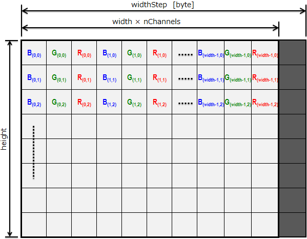

OpenCV中IplImage,CvMat和CvArr的区别
====

CvArr -> CvMat -> IplImage

这三者就是派生与继承的关系[1]

1.CvArr

	/* CvArr* is used to pass arbitrary
	* array-like data structures
	* into functions where the particular
	* array type is recognized at runtime:
	*/
	typedef void CvArr;

就是 void类型 

2.CvMat

CvMat 由宽度（width）、高度（height）、类型（type）、行数据长度（step 用字节数来度量）和一个指向数据的指针构成。

创建方式：CvMat * cvCreateMat( int row, int cols,int type)及其类似的函数可以创建。type可以是任意数据类型或结构体（类）。

	{
		int type;	/*创建的图像元素类型(uchar,short,int,float,double)*/
		int step;	/*每一行长度，以byte记算*/
		int* refcount;	/*指针的引用计数器; 阵列指向用户分配的数据时，指针为 NULL*/
		union{
			uchar* ptr;	/*Data pointer for an unsigned char matrices*/
			short* s;	/* Data pointer for a short matrices*/
			int* i;		/* Data pointer for an integer matrices */
			float* f;	/* Data pointer for a float matrices */
			double* db;	/* Data pointer for a double matrices */
		}data;	/*Data pointer*/

		union{
			int rows;
			int height;
		     };
		union{
			int cols;
			int width;
		     };
	}CvMat;

举例来说，type可能的值为：

	Mat::type
	Returns the type of a matrix element.

	C++: int Mat::type() const
	The method returns a matrix element type. This is an identifier compatible with the CvMat type system, like CV_16SC3 or 16-bit signed 3-channel array, and so on.
	
depth可能为：

C++: int Mat::depth() const
The method returns the identifier of the matrix element depth (the type of each individual channel). For example, for a 16-bit signed element array, the method returns CV_16S . A complete list of matrix types contains the following values:

	CV_8U - 8-bit unsigned integers ( 0..255 )
	CV_8S - 8-bit signed integers ( -128..127 )
	CV_16U - 16-bit unsigned integers ( 0..65535 )
	CV_16S - 16-bit signed integers ( -32768..32767 )
	CV_32S - 32-bit signed integers ( -2147483648..2147483647 )
	CV_32F - 32-bit floating-point numbers ( -FLT_MAX..FLT_MAX, INF, NAN )
	CV_64F - 64-bit floating-point numbers ( -DBL_MAX..DBL_MAX, INF, NAN )

3.IplImage

可以看出，IplImage除了包含CvMat的基本矩阵成员变量之外，还自己增加了许多关于图像的信息变量。也为图像处理操作带来了便利。

	{
	    int  nSize;             /* IplImage大小 */
	    int  ID;                /* 版本 (=0)*/
	    int  nChannels;         /* 大多数OpenCV支持1、2、3或4个通道*/
	    int  alphaChannel;      /* 被OpenCV忽略*/
	    int  depth;             /* 像素的位深度，支持如下格式: IPL_DEPTH_8U、IPL_DEPTH_8S, IPL_DEPTH_16S、IPL_DEPTH_32S、IPL_DEPTH_32F、IPL_DEPTH_64F*/
	    charcolorModel[4];     /* 被OpenCV忽略*/
	    charchannelSeq[4];     /* 被OpenCV忽略*/
	    int  dataOrder;         /* 0表示交叉存取颜色通道, 1表示分开的颜色通道，只有cvCreateImage可以创建交叉存取图像*/
	    int  origin;            /*图像原点位置，0表示顶-左结构（左上角），1表示底-左结构（右下角） */
	    int  align;             /* 图像行排列方式（4或者8），被OpenCV忽略，使用widthStep代替*/
	    int  width;             /* 图像宽相位数*/
	    int  height;            /* 图像高相位数*/
	    struct_IplROI*roi;    /* 图像感兴趣区域，当该值非空时，只对该区域处理*/
	    struct_IplImage*maskROI;      /* 在OpenCV中必须为NULL */
	    void  *imageId;                 /* 在OpenCV中必须为NULL */
	    struct_IplTileInfo*tileInfo;  /* 在OpenCV中必须为空 */
	    int  imageSize;         /* 图像数据大小（在交叉存取格式下imageSize = image->height*image->widthStep） 单位字节)*/
	    char*imageData;        /* 指向排列的图像数据*/
	    int  widthStep;         /* 排列的图像行大小，单位字节 */
	    int  BorderMode[4];     /* 被OpenCV忽略*/
	    int  BorderConst[4];    /* 被OpenCV忽略*/
	    char*imageDataOrigin;  /* 指针指向一个不同的图像数据结构（不是必须排列的） 是为了纠正图像内存分配准备的 */
	}IplImage;

可以看出IplImage中又很多字段被opencv忽略。

上图来自网站[3].

所以，获得一个像素的RGB值应该这样调用的[4]：

	((uchar *)(img->imageData + hIndex*img->widthStep))[wIndex*img->nChannels + 0]=imageData[i+2]; // B
	((uchar *)(img->imageData + hIndex*img->widthStep))[wIndex*img->nChannels + 1]=imageData[i+1]; // G
	((uchar *)(img->imageData + hIndex*img->widthStep))[wIndex*img->nChannels + 2]=imageData[i]; // R

###Reference:

[1] http://blog.csdn.net/u010076558/article/details/27357687

[2] http://blog.csdn.net/ZYTTAE/article/details/41652191

[3] http://imagingsolution.blog107.fc2.com/

[4] http://vgl-ait.org/cvwiki/doku.php?id=gltocv:main 对Iplimage非常好的解释

