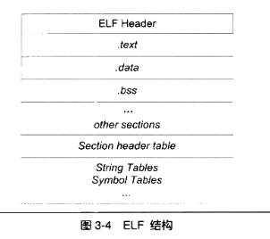
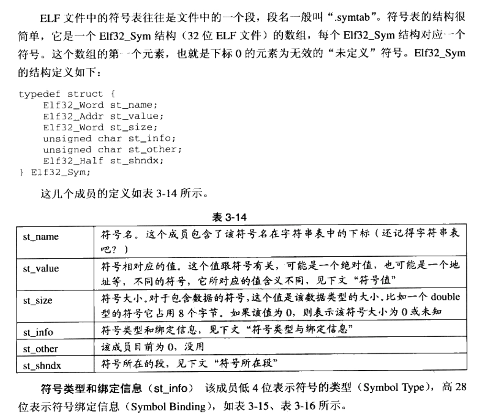

ELF file struture
====

A simple C code:

``` cpp
int printf( const char* format, ...);

int global_init_var = 84;  // global variable; initialized
int global_uninit_var;  // global varibale; not intitialized

void func1( int i )
{
    printf("%d\n", i);
}

int main(void)
{
    static int static_var = 85; // static variable; initialized
    static int static_var2; // static variable; not initialized
    int a = 1;
    int b;

    func1( static_var + static_var2 + a + b);

    return a;
}
```
***
###Use gcc to compile the code(-c indicates that only compile not link)
gcc -c SimpleSection.c

Then it generates SimpleSection.o.

###Use objdump to see the structure of this object
objdump -h SimpleSection.o

***Notice*** If you use Mac, please first brew install binutils. Then replace objdump to gobjdump.

See the result:

	xiaomengmacpro:linker zhaoxm$ gobjdump -h SimpleSection.o

	SimpleSection.o：     文件格式 mach-o-x86-64

	节：
	Idx Name          Size      VMA               LMA               File off  Algn
	  0 .text         00000056  0000000000000000  0000000000000000  00000260  2**0
	                  CONTENTS, ALLOC, LOAD, RELOC, CODE
	  1 .data         00000008  0000000000000058  0000000000000058  000002b8  2**2
	                  CONTENTS, ALLOC, LOAD, DATA
	  2 .cstring      00000004  0000000000000060  0000000000000060  000002c0  2**0
	                  CONTENTS, ALLOC, LOAD, READONLY, DATA
	  3 __DATA.__bss2 00000004  00000000000000f0  00000000000000f0  00000000  2**2
	                  ALLOC
	  4 .eh_frame     00000088  0000000000000068  0000000000000068

We only focus on the text section and data section first. It is easy to understand what is "Size" and what is "File offset". The "CONTENTS, ALLOC, LOAD, RELOC, CODE" indicates the attributes of this section. "CONTENTS" represents that this section exists in this file. Section bss doesn't have this attribute.

###Use gsize to get the size of each section
gsize SimpleSection.o

	xiaomengmacpro:linker zhaoxm$ gsize SimpleSection.o
	   text	   data	    bss	    dec	    hex	filename
	    226	      8	      4	    238	     ee	SimpleSection.o

Only `initialized global static variables and local static variales` are stored in data section. In our code, they are `global_init_variable` and `static_var`. Both of them are int. So the size of data section is 8 bytes.


###See the read only section
gobjdump -x -s -d SimpleSection.o

	Contents of section .data:
	 0058 54000000 55000000                    T...U...
	Contents of section .cstring:
	 0060 25640a00                             %d..

Usually, compiler will put the constant string variable in the read only section. In the linux, this read only section is called `.rodata`. In the mac, it is called `cstring`. As shown above, the constant string `%d\n` is stored in cstring section. `0x25` corresponds with character `%`.

There are many advantages in read only section:
 
 1. It supports the "const" keyword in C++.
 2. When operate system load this section, it can set the attribute of this section to "read only". So any modification of this section will be considered as illegal operation. It gurantee the program safety.
 3. In some embeded system, there are many read-only memry (ROM). So this read only section can stored in it.

###See the BSS section

The BSS section stores the uninitialized `global variables` and `local static variables`. 

However, just as shown above:

	xiaomengmacpro:linker zhaoxm$ gsize SimpleSection.o
	   text	   data	    bss	    dec	    hex	filename
	    226	      8	      4	    238	     ee	SimpleSection.o

BSS section is of size 4 bytes. It doesn't match the size of `global_uninit_var` and `static_var2`, which should be of 8 bytes. 

In fact, in the `symbol table`, we could find that the `global_unint_var` is not storaged in any section. It is only a `Common Symbol`. 

	xiaomengmacpro:linker zhaoxm$ gobjdump -x -s -d SimpleSection.o

	SimpleSection.o：     文件格式 mach-o-x86-64
	SimpleSection.o
	体系结构：i386:x86-64，标志 0x00000011：
	HAS_RELOC, HAS_SYMS
	起始地址 0x0000000000000000

	节：
	Idx Name          Size      VMA               LMA               File off  Algn
	  0 .text         00000056  0000000000000000  0000000000000000  00000260  2**0
	                  CONTENTS, ALLOC, LOAD, RELOC, CODE
	  1 .data         00000008  0000000000000058  0000000000000058  000002b8  2**2
	                  CONTENTS, ALLOC, LOAD, DATA
	  2 .cstring      00000004  0000000000000060  0000000000000060  000002c0  2**0
	                  CONTENTS, ALLOC, LOAD, READONLY, DATA
	  3 __DATA.__bss2 00000004  00000000000000f0  00000000000000f0  00000000  2**2
	                  ALLOC
	  4 .eh_frame     00000088  0000000000000068  0000000000000068  000002c8  2**3
	                  CONTENTS, ALLOC, LOAD, RELOC, READONLY, DATA


###Insert a image into a execurable file as a new section

Note: The OS X x86-64 environment uses Mach-O (not ELF) as its executable file format.

##The structure of ELF ( Extensble Linking Format) file
`Note:` The OS X x86-64 environment uses Mach-O (not ELF) as its executable file format.
 

The ELF Header includes the basic attributes of the file, such as ELF file version, machine version, entry point address. Then, the sections follow. Next is the Section header table, which describes the name, size, offset in the file, permission of each section. 
	
### See the Header of Mach-O file

	xiaomengmacpro:linker zhaoxm$ otool -v -h SimpleSection.o
	SimpleSection.o:
	Mach header
	      magic cputype cpusubtype  caps    filetype ncmds sizeofcmds      flags
	MH_MAGIC_64  X86_64        ALL  0x00      OBJECT     3        576 SUBSECTIONS_VIA_SYMBOLS

### String Table
In the ELF file, we use many strings, such as section name, variable name. Since the length of string is variable, it is hard to represent it by fixed structure. So we put these strings together in the `String Table`. You can use the index to reference the string without considering the length of this string. 

## Symbol

1. global simple defined in the object file, such as the "func1", "main" and "global\_init\_var" in the SimpleSection.o. 
2.  External Symbol, which is the signal not defined in this object file. For example, the "printf" symbol in the SimpleSection.o is an external symbol.
3.  Section name.
4. local symbol, such as the "static_var" and "static_var2" in the SimpleSection.o. These local symbols have nothing to do with linker, so linker always ignore them. 
5. line number.

20世纪70年代前，编译器编译源代码产生目标文件时，符号名与对应的变量函数的名字是一样的。比如一个汇编源代码里包含一个函数foo，那么汇编器产生了目标文件后，foo在目标文件中的对应的符号名也为foo。如果一个C语言程序要用这些库的话，C语言不可以使用这些库中定义的函数和变量的名字作为符号名，否则将会跟现有的目标文件冲突。

为了防止符号冲突。UNiX的C语言规定经过编译后，相对应的符号名前加上下划线“\_”. 但是，当程序很大时， 不同的模块由不同的人开发，他们之间还是有可能冲突。于C++语言增加了命名空间的方法来解决多模块的符号冲突问题。

 

### extern "C"
比如C语言库函数中的string.h中声明了memset这个函数，如果不加处理。当我们C++语言程序用到memset函数时，编译器会认为memset函数是一个C++函数，修饰为\_Z6memsetPvii，这样编译器就无法与C语言库中的memset符号进行链接。所以对于C++来说，必须使用extern "C"来声明memset这个函数。但是C语言不支持 extern "C"这个语法。我们希望无论是写C或者C++程序，只需要include一个头文件就可以了，两个语言定义两套头文件大可不必。所以，系统的头文件经常这么写：

	#ifdef __cplusplus
	extern "C" {
	#endif
	
	void *memset(void *, int, size_t);
	
	#ifdef __cplusplus
	}
	#endif

使用C++的宏"__cplusplus"，C++编译器会在编译C++的程序时默认定义这个宏。

###弱符号/强符号，弱引用/强引用
程序员自我修养的例子在mac下不work.

##调试信息
几乎所有先打的编译器都支持源代码级别的调试，比如我们可以在函数里面设置断点，可以监视变量变化，可以单步行进等。**这都需要编译器将源代码和目标代码之间的关系保存在目标文件里**。

GCC编译的时候加上-g参数， 编译器就会在产生的目标文件里加上调试信息。ELF文件采用DWARF(Debug With Arbitrary Record Format)标准来存储调试信息。而微软的调试信息标准为CodeView.

那么问题来了，为什么visual studio编译的时候分debug版和release版？
调试信息在目标文件和可执行文件中占用很大的空间，往往比程序的代码和数据本身大好几倍，所以当我们开发完程序并将它发布的时候后，须要把这些对于用户没有用的调试信息去掉，以节省大量的空间。


