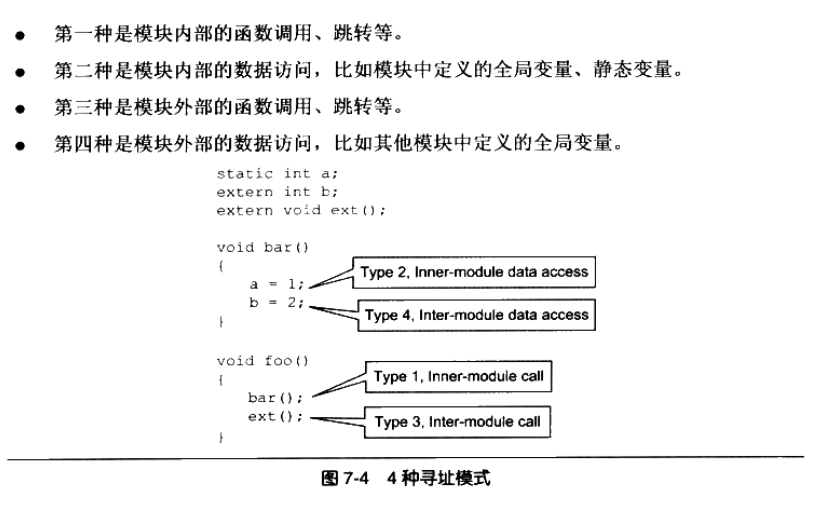

Dynamic Link
====
动态链接的工作是由动态连接器完成的，而不是静态连接器ld完成。动态链接是把链接这个过程从本来的程序装载前推迟到了装载的时候。

动态链接每次装载时都要进行重新链接，是不是会很慢？
会损失一些，但是有很多优化措施，如延迟绑定（Lazy Binding）等方法，可以使得动态链接的性能损失尽可能的小，性能损失在5%以下。

``` c++
/* Program1.c */
#include "Libc.h"

int main()
{
    foobar(1);
    return 0;
}

/* Program2.c */
#include "Lib.h"

int main()
{
    foobar(2);
    return 0;
}

/* Lib.c */
#include <stdio.h>

void foobar(int i)
{
    printf("Printing from Lib.so %d\n", i);
}

/* Lib.h */
#ifndef LIB_H
#define LIB_H

void foobar(int i);

#endif
```

两个程序的主要模块Program1.c和Program2.c分别调用了Lib.c里面的foobar()函数。
首先将Lib.c编译成一个共享对象文件：
	
	gcc -fPIC -shared -o Lib.so Lib.c

上述参数“-shared”参数表示产生共享对象。

当程序模块Program1.c被编译成Program1.o时，编译器好不知道foobar()函数的地址。如果foobar()是一个定义在静态目标模块的函数，那么链接器会按照静态链接的规则，将Program1.o中的foobar地址引用重定位；如果foobar()是一个定义在某个动态共享对象中的函数，那么链接器就会将这个符号的引用标记为一个动态链接的符号，不对它进行地址重定位，把这个过程留在装载时再进行。

####如何知道foobar的引用是一个静态符号还是一个动态符号？

这实际上就是我们要用到Lib.so的原因。Lib.so保存了完整的符号信息（因为运行时进行动态链接还需使用符号信息），把Lib.so也作为链接的输入文件之一，连接器在解析符号时就可以知道：foobar是一个定义在Lib.so的动态符号。这样链接器就可以对foobar的引用做特殊的处理，使它成为一个对动态符号的引用。


####什么是模块？
静态连接时，整个程序最终只有一个可执行文件，它是一个不可以分割的整体；但是在动态链接下，一个程序被分成了若干个文件，有程序的主要部分，即可执行文件（Program1）和程序所以来的共享对象（Lib.so），很多时候我们把动态链接下的可执行文件和共享对象都看做是程序的一个模块。


###地址无关代码
共享对象在被装载时，如何确定它在进程虚拟地址空间中的位置？

`静态共享库（Static Shared Library`， 将程序的各种模块统一交给操作系统来管理，操作系统在某个特定的地址划分出一些地址块，为那些已知的模块预留足够的空间。比如把0x1000到0x2000分配给模块A，把地址0x2000到0x3000分配给模块B。这样做有很多问难题，当共享库升级后，必须保证共享库原理啊的函数和变量地址不变，因为应用程序在链接时已经绑定了这些地址。一旦更改


`装载时重定位`，在链接时，对所有的绝对地址的引用不做重定位，而把这一步推迟到装载时再完成。假设函数foobar相对于代码段的起始地址是0x100，当模块被装载到0x10000000时，我们假设代码段位于模块的最开始，即代码段的装载地址也是0x10000000，那么我们就可以确定foobar的地址为0x10000100。

但是，很大的缺点是动态链接库中的很多部分不能在多个进程之间共享。把指令中那些需要被修改的部分分离出来，跟数据部分放在一起，这样指令部分就可以保持不变，而数据部分可以在每个进程中拥有一个副本。这种方案就是目前被称为地址无关代码（PIC，Position-independent Code）的技术。

其实，产生地址无关的代码并不麻烦，我们来分析模块中各种类型的地址引用方式。这里我们把共享对象模块中的地址引用按照是否为跨模块分为两类：模块内部引用和模块外部引用。



###Q & A
当lib.so被两个进程加载时，它的数据段部分在每个进程中都有独立的副本。共享对象中的全局变量实际上和定义在程序内部的全局变量没什么区别。任何一个进程访问的只是自己的那个副本，而不影响其他进程。
但是，对于同一个进程中的线程A和线程B，它们访问的是同一个进程地址空间，也就是同一个lib.so的副本，所以对全局变量的修改，对方都是看的到的。

###动态链接的步骤

完成基本自举（bootstrap）后，动态连接器将可执行文件和连接器本身的符号表合并到一个符号表当中，可以称它为全局符号表（Global Symbol Table）。然后链接器开始寻找可执行文件锁依赖的共享对象，广度优先将依赖的共享对象都装在近来。当一个新的共享对象被装在进来的时候，它的符号表会被合并到全局符号表中。所以，当所有的共享对象都被装载进来的时候，全局符号表里面将包含进程中所有的动态链接所需要的符号。

####dlopen()函数
dlopen函数用来打开一个动态库，并将其加载到进程的地址空间，完成初始化过程，它的C原型定义为：
	
	void * dlopen(const char * filename, int flag);
第一个参数是被加载动态库的路径，如果这个路径是绝对路径（以“/”开始的路径），则该函数会尝试直接打开该动态库。如果是相对路径，那么dlopen()会尝试咦一定的顺序去查找该动态库文件。

（1）查找环境变量LD_LIBRARY_PATH指定的一系列目录

（2）查找由/etc/ld.so.cache里面所指定的共享库路径

（3）/lib, /usr/lib

而且，更有意思的是，当我们将filename的参数设置为0，那么dlopen返回的将是全局符号表的句柄，也就是我们可以在运行时找到全局符号表里面的任何一个符号，并且可以执行它们，类似高级语言反射（Reflection）的特性。

####dlsym()函数
dlsym函数基本上是运行时装载的核心部分，可以通过这个函数找到所需要的符号。定义如下：

	void * dlsym(void * handle, char * symbol);
	
第一个参数是由dlopen()返回的动态库的句柄；第二个参数即要查找的符号的名字。如果找到这个符号，如果符号是函数，则返回函数的地址。如果是个变量，则返回变量的地址。如果这个符号是个常量，则返回该常量的值。如果没要找到符号，则返回NULL即0。

***Notice***
但是，如果常量值刚好是0，我们该怎么知道到底符号是否存在呢？dlclose()函数用来解决这一问题，每次我们调用dlopen(),dlsym()或dlclose()以后，我们都可以调用dlerror()函数来判断上一次调用是否成功。

###共享库版本命名
Linux有一套规则来命名系统中的每一个共享库，它规定文件的命名规则如下：

	libname.so.x.y.z
最前面使用前缀lib，中间是哭的名字和后缀“.so，最后面跟着的是三个数字组成的版本号。“x”表示主版本号（Major Version Number），“y”表示次版本号（Minor Version Number）, "z"表示发布版本号（Release Version Number）。

主版本号表示库的重大升级，不同主版本号的库之间是不兼容的，依赖于旧的主版本号的程序要改动相应的部分，并且重新比哪一，才可以在新版的共享库中运行。或者，系统必须保留旧版的共享库。

次版本号表示库的增量升级，即增加一些新的接口符号，且保持原来的符号不变。在主版本号相同的情况下，高的次版本号的库向后兼容低的次级版本号的库。依赖于旧的次版本号共享库的程序，可以在新的次版本号共享库中运行，因为新版中保留了原来所有的接口，并且不改变他们的定义和含义。比如libfoo.so.1.3.x里面有所有的libfoo.so.1.2.x的接口。	


