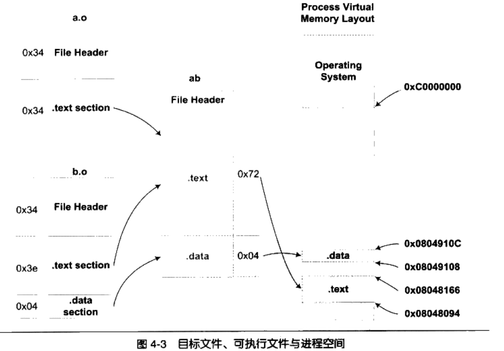
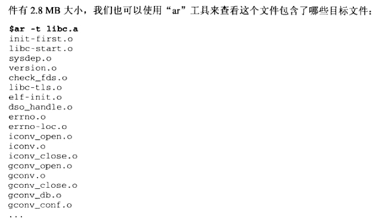
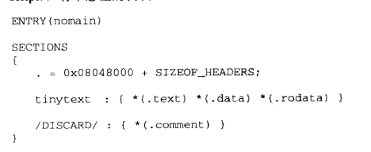
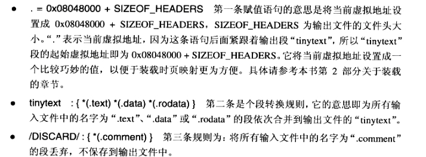
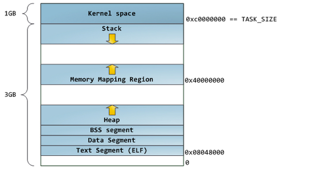

C linker 
====

link the a.c and b.c.

``` c
// a.c
extern int shared;

int main()
{
	int a = 100;
	swap( &a, &shared);
}

// b.c
int shared = 1;

void swap( int* a, int* b)
{
	*a ^= *b ^= *a ^= *b;
}
```

	gcc -c a.c b.c
	\\link them
	\\ If you use Mac OS, you need t add -lSystem
	ld a.o b.o -e main -o ab -lSystem
这时输出a.o, b.o两个目标文件。
链接器的工作：将几个输入的目标文件加工后合成一个输出文件。
两步链接（Two-pass Linking）方法：

1. 空间与地址分配。扫描所有的输入文件，获得它们的各个段的长度，属性和位置，并且将输入目标文件中的符号定义和符号引用手机起来，统一放到一个全局符号表。连接器能够获得所有输入目标文件的段长度，并且将它们合并，计算出输出文件合并后的长度与位置，并建立映射关系。
2. 符号解析与重定位。读取输入文件中短的数据，重定位信息，并且对符号解析与重定位，调整代码中的地址。



查看a.o的代码段反汇编结果：
 
	xiaomengmacpro:linker zhaoxm$ gobjdump -d a.o

	a.o：     文件格式 mach-o-x86-64


	Disassembly of section .text:

	0000000000000000 <_main>:
	   0:	55                   	push   %rbp
	   1:	48 89 e5             	mov    %rsp,%rbp
	   4:	48 83 ec 10          	sub    $0x10,%rsp
	   8:	c7 45 fc 64 00 00 00 	movl   $0x64,-0x4(%rbp)
	   f:	48 8d 45 fc          	lea    -0x4(%rbp),%rax
	  13:	48 8b 15 00 00 00 00 	mov    0x0(%rip),%rdx        # 1a <_main+0x1a>
	  1a:	48 89 d6             	mov    %rdx,%rsi
	  1d:	48 89 c7             	mov    %rax,%rdi
	  20:	b8 00 00 00 00       	mov    $0x0,%eax
	  25:	e8 00 00 00 00       	callq  2a <_main+0x2a> #call swap function
	  2a:	c9                   	leaveq
	  2b:	c3                   	retq

这里面调用swap函数的地址为<_main+0x2a>，这时候只是一个假地址。该地址需要在链接过程中重新定位。

查看ab反汇编结果：

	xiaomengmacpro:linker zhaoxm$ gobjdump -d ab

	ab：     文件格式 mach-o-x86-64


	Disassembly of section .text:

	0000000000001eea <_main>:
	    1eea:	55                   	push   %rbp
	    1eeb:	48 89 e5             	mov    %rsp,%rbp
	    1eee:	48 83 ec 10          	sub    $0x10,%rsp
	    1ef2:	c7 45 fc 64 00 00 00 	movl   $0x64,-0x4(%rbp)
	    1ef9:	48 8d 45 fc          	lea    -0x4(%rbp),%rax
	    1efd:	48 8d 15 fc 00 00 00 	lea    0xfc(%rip),%rdx        # 2000 <_shared>
	    1f04:	48 89 d6             	mov    %rdx,%rsi 
	    1f07:	48 89 c7             	mov    %rax,%rdi
	    1f0a:	b8 00 00 00 00       	mov    $0x0,%eax
	    1f0f:	e8 02 00 00 00       	callq  1f16 <_swap>  #call swap function
	    1f14:	c9                   	leaveq
	    1f15:	c3                   	retq

	0000000000001f16 <_swap>:
	    1f16:	55                   	push   %rbp
	    1f17:	48 89 e5             	mov    %rsp,%rbp
	    1f1a:	48 89 7d f8          	mov    %rdi,-0x8(%rbp)
	    1f1e:	48 89 75 f0          	mov    %rsi,-0x10(%rbp)
可以看出main函数里面两个重定位入口都已经被修正到正确的位置。

##重定位表
一个重定位表往往就是一个ELF文件的一个段，所以重定位表也可以叫重定位段。
使用objdump查看目标文件的重定位表：

	xiaomengmacpro:linker zhaoxm$ gobjdump -r a.o

	a.o：     文件格式 mach-o-x86-64

	RELOCATION RECORDS FOR [.text]:
	OFFSET           TYPE              VALUE
	0000000000000026 BRANCH32          _swap
	0000000000000016 GOT_LOAD          _shared


	RELOCATION RECORDS FOR [.eh_frame]:
	OFFSET           TYPE              VALUE
	0000000000000020 SUBTRACTOR64      EH_frame1
	0000000000000020 64                _main

###函数级别链接
当我们需要用到某个目标文件中的任意一个函数或变量时，就须要把它整个地链接起来，也就是那些没有用到的函数也被一起链接进来。这样的结果是链接输出文件会变得很大，所有用到的没用到的变脸和函数都一起塞到输出文件中。VISUAL C++编译器提供一个编译选项叫函数级别链接（Functional-Level Linking），这个选项的作用是让所有的函数都像前面的模板函数一样，单纯保存到一个段里面。但是这个优化选项会减慢编译和链接过程，因为连接器需要计算各个函数之间的依赖关系，并且所有含数据都保持到独立端中，目标函数的段的数量大大增加，重定位工程也会更加复杂。
GCC中是"--ffunction-sections"和"-fdata-sections".
###全局构造与析构
在main函数被调用之前，需要初始化进程执行环境，比如堆分配初始化（malloc，free），线程子系统，C++全局对象构造函数也是在这一时期被执行的。
两个特殊的段：

.init 该段保存的是可执行指令，它构成了进程的初始化代码。因此，当一个程序开始运行时，在main函数执行之前，Glibc的初始化部分安排执行这个段的中的代码。

.fini 该段保存进程终止代码指令，当一个程序的main函数正常退出时，Glibc会安排执行。

利用这两个段，C++的全局构造和析构函数就由此实现。

##静态库

其实一个静态库可以简单地看成一组目标文件的集合，即很多目标文件经过压缩打包后形成一个文件。
看一看静态连接库里面是什么。 libc.a 在 /usr/lib中。



为什么库里的目标文件只包含一个函数？
`链接器在链接静态库的时候是以目标文件为单位的。`比如，我们引用了静态库中的printf()函数，那么连接器就会把库中包含的printf()函数的哪个目标文件链接起来。没有用到的目标文件（函数）就不要链接到最终的输出文件中。


###链接脚本
控制链接过程是控制输入段如何变成输出段，比如哪些输入端要合并成一个输出段，哪些输入段要丢弃。





###Linux进程内存布局及内存管理函数总结

进程是ELF格式可执行文件加载到内存中的程序。对于一个进程来说，其内存空间包括以下几个部分：

1. 代码段： 程序的代码存放的区域，只读区。

2. 全局区： 存放全局变量和静态(static)变量，main函数执行之前分配全局变量。

3. BSS段： 存放未初始化的全局变量，在main函数之前执行，并清空BSS段，将所有变量初始化为0.

4. 栈区： 非静态(nonstatic)局部变量，包括函数的参数，栈区的内存管理由系统完成，自动分配自动回收。

5. 堆区： 用于动态内存分配。

以上五个区域在内存中的布局如下图：

