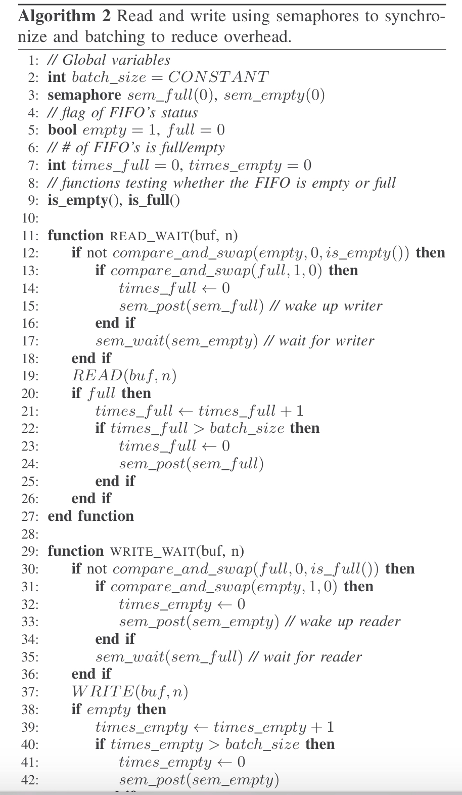

ShmStreaming: A Shared Memory Approach for Improving Hadoop Streaming Performance
========

这篇论文本质上有两点

1. Hadoop streaming技术本身是使用Linux管道技术实现的。C++程序在一个进程中，Hadoop在另一个进程，通过管道传送数据。作者觉得通过管道传输数据会有很多system calls，会导致速度慢，所以想改进为共享内存来传输key，value对。
2. 还有一点创新，在共享内存中是吸纳一个FIFO。Hadoop往里面写数据，C++进程读数据。但是一般hadoop往里面放数据比较快，处理比较慢，所以队列经常是满的，为了让Hadoop调用的write少发点信号量，本文采用batch read和batch write，挺晦涩的。

